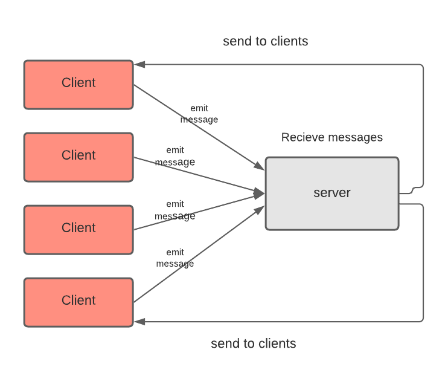

# LAB - Class 12,13,14

## Project: Chat House

## Author

### 1. Omer Ramadan

### 2. Haneen Zeyad

### 3. Malak Momani

### 4. Qais Ata

### Links and Resources

- [back-end server url](https://chat-house-project.herokuapp.com/)

### Setup

#### `.env` requirements (where applicable)

- `PORT` - Port Number

#### How to initialize/run your application (where applicable)

- `npm install`
- `npm start`

## Chat-House

Chat application that allows users start chatting in separate rooms

## Dependencies

- dotenv
- ejs
- express
- socket.io
- moment

## UML Diagram

